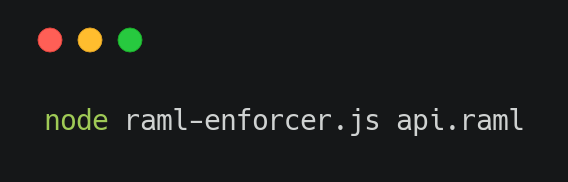

## Talk is cheap. Show me the code.
### - Linus Torvalds

#### RAML Enforcer

RAML Enforcer is a command line tool for identifying and reporting on syntax issues and stylistic errors found within RAML code.

[Show me the code](https://github.com/Mike-Gough/raml-enforcer)
